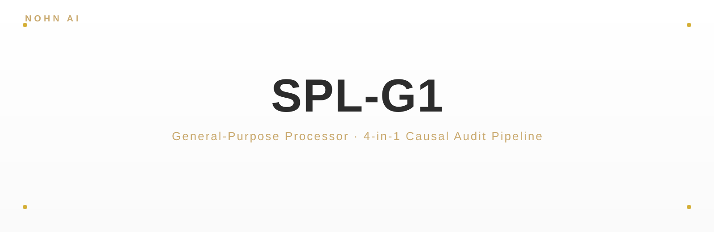
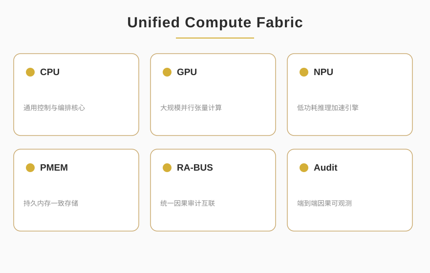

<p align="center">
  
</p>

<p align="center">
  
  
  
</p>

<blockquote align="center">
  <em>General-Purpose Processor · 4-in-1 Causal Audit Pipeline</em>
</blockquote>

<div style="max-width:880px;margin:0 auto;padding:0 16px">

## ✦ About

<p style="font-size:15px;line-height:1.8;color:#2C2C2C">SPL-G1 is a 4-in-1 hardware causal audit pipeline that unifies CPU, GPU, NPU, and persistent memory under a single execution plane with causal-level observable audit across the entire compute lifecycle. Built around the RA-BUS interconnect, it converges heterogeneous compute into one verifiable execution surface, providing a hardware foundation for compliance computing and trustworthy AI inference.</p>

<p align="center">
  
</p>

</div>

<p align="center">— ✦ —</p>

## ✦ Quick Start

```bash
git clone git@github.com:NOHN-AI/SPL-G1-GENERAL-PURPOSE-PROCESSOR.git
cd SPL-G1-GENERAL-PURPOSE-PROCESSOR
pip install -r requirements.txt
python audit_pipeline.py
```

<p align="center">— ✦ —</p>

<p align="center">
  <a href="https://github.com/NOHN-AI">NOHN-AI</a>
  &nbsp;·&nbsp;
  <a href="https://www.nohnlins.com/">nohnlins.com</a>
  &nbsp;·&nbsp;
  <a href="mailto:ai@nohnlins.com">ai@nohnlins.com</a>
</p>
<p align="center"><sub>NOHN AI · SPL-G1</sub></p>
