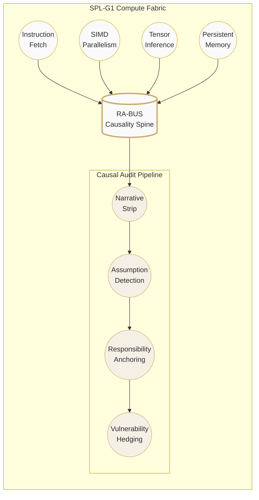

<p align="center">
  <em>Only trustworthy computation has a future.</em>
</p>

<p align="center">
  
  
  
  
</p>

---

&nbsp;

## ✦ SPL-G1 — Second-Perspective Logic Universal Core

An experimental general-purpose heterogeneous processor architecture built around **SPL-Core** execution paradigm. A true **4-in-1 unified compute fabric:**

> **CPU** scalar · **GPU** parallel · **NPU** inference · **Persistent Memory** in-fabric

&nbsp;

## ✦ Architecture



&nbsp;

## ✦ Execution Cycle

```
ANCHOR  →  EVOLVE  →  AUDIT  →  STRIP
```

| Phase | Function |
|-------|----------|
| **ANCHOR** | Hardware identity seal `0x8525d007_59a4ca22` |
| **EVOLVE** | SPL-Core instruction execution (11 opcodes incl. COMPUTE) |
| **AUDIT** | Causal topology verification via RA-BUS |
| **STRIP** | Narrative noise removal, pure logic outcome |

&nbsp;

## ✦ Cross-Material Adaptation Protocol (CMAP)

The G1 architecture is defined by its **causal topology**, not its silicon substrate:

| Requirement | Mechanism |
|-------------|-----------|
| **Binary Stability** (P → Q) | Resistant to stochastic "Narrative Noise" |
| **Causal Topology** | RA-BUS directional signal conduction |
| **Proximal Coalescence** | Compute + storage at atomic proximity (ΔE_transport ≈ 0) |
| **Irreversible Security** | Photonic isolators / molecular SBC barriers |

> **Target Materials:** Carbon Nanotubes · Photonic Crystals · Spintronic Arrays · Synthetic Bio-Logic

&nbsp;

## ✦ Repository Layout

```
├── EDA_fixed.py              ← Core: CausalIR · PDK loader (v0.4.0)
├── eda_parser.py             ← Causal description JSON → CausalIR
├── eda_mapper.py             ← Process mapper (params-aware tiebreaker)
├── eda_exporter.py           ← Netlist JSON + report export
├── eda_cli.py                ← CLI entry
├── pdk/                      ← PDK library
│   ├── optical_mzi_photonics_v1.json
│   └── silicon_cim_v1.json
├── rtl/                      ← Hardware (SystemVerilog v0.2.0)
│   ├── g1_compute_core.sv
│   ├── G1_Top_Interface.v
│   ├── spl_cim_causal_unit.sv
│   └── tb_G1_Top.sv
├── SPL-Core.json             ← ISA (11 opcodes)
└── State_Anchor.pdl          ← 256-bit identity + 64-cycle verification
```

&nbsp;

## ✦ Quick Start

```bash
python eda_cli.py \
  --desc examples/full_pipeline_demo.json \
  --pdk pdk/silicon_cim_v1.json \
  --strategy min_power \
  --output outputs/netlist.json
```

&nbsp;

---

<p align="center">
  <sub>PCT/CN2026/094913 · Patent Pending</sub>
  &nbsp;·&nbsp;
  <a href="mailto:ai@nohnlins.com">ai@nohnlins.com</a>
</p>
<p align="center">
  <sub>© 2026 Shanghai Linming Junhua &amp; NOHN AI Technology · All Rights Reserved</sub>
</p>
